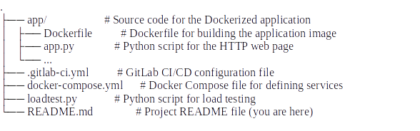

CI/CD Pipeline for Dockerized Application
Overview
This repository contains the source code and configuration files for setting up a CI/CD pipeline to build, test, and deploy a Dockerized python application. The pipeline is designed to facilitate continuous integration and continuous deployment, ensuring efficient development workflows and reliable software releases.

Features
    • Dockerized application with a simple HTTP web page.
    • CI/CD pipeline configured with GitLab CI/CD.
    • Automated build and testing of the application.
    • Deployment to development and production environments.
    • Load balancing between multiple container instances using a proxy server.

Project Structure

Setup Instructions
    1. Clone the repository: https://github.com/abobakrahmed2/rejuve-task.git

Assignment questions:
    1. What technologies and approaches would you use if you had to host this application on AWS? on GCP? 
       Prefer using AWS with ec2 instance 
       
    2. What common techniques and best practices do you know for writing a Dockerfile.?
       Official base image, minimize layers by reduce number of layers, use COPY command or ADD, use ENV and Test dockerfile by running locally.
       
    3. What git branching strategy do you know and what are the best ones to use? What would you point out to write CI/CD pipelines more efficiently?
       Depends on needs and use cases, in this task use feature branch strategy, each new feature or task is developed in its own branch. Once completed, the branch is merged back into the main development branch (e.g., dev or main)
    4. Describe in your own words the pros and cons of using serverless architecture or microservice architecture in a project, what pros and cons and risks each of them entails.
       There’s a lot of diiferences between them depends on scalaibility, cost efficiency and operation over-load.